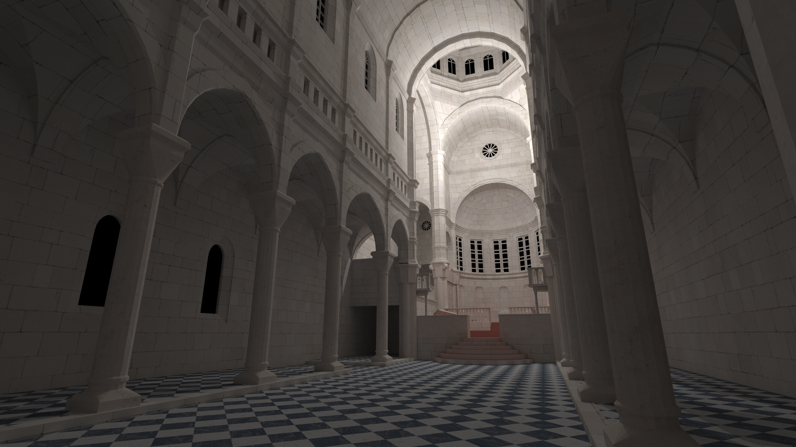
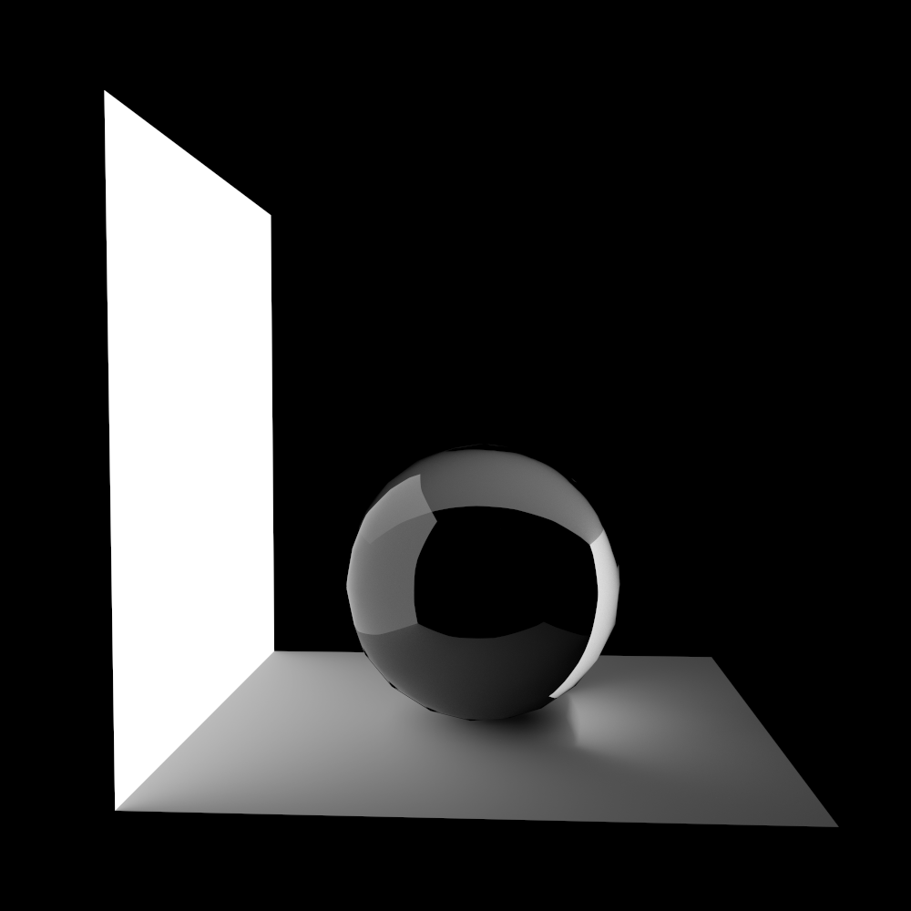

nanogi
====================

A small, reference GI renderer.



[](https://travis-ci.org/lighttransport/nanogi)

Introduction
--------------------

**nanogi** is a small global illumination (GI) renderer intended to be utilized as a reference renderer. The application is written in C++, focusing on the *correctness* of the implementation rather than *performance*, e.g., we removed caches which is often introduced as an optimization. In the overall of the implementation, we tried to compute the equation in the original mathematical formulation *as it is*, as much as possible.

Building
--------------------

### Dependencies

- [CMake](http://www.cmake.org/) 3.0 and higher
- [Boost](http://www.boost.org/) 1.56.0 and higher
- [Assimp](http://assimp.sourceforge.net/) 3.1.1  and higher
- [FreeImage](http://freeimage.sourceforge.net/) 3.15.4 and higher 
- [glm](https://github.com/g-truc/glm) 0.9.3.3 and higher
- [yaml-cpp](https://github.com/jbeder/yaml-cpp) 0.5.1 and higher
- [embree](https://embree.github.io/) 2.5.0 and higher
- [Intel TBB](https://www.threadingbuildingblocks.org/) 4.3 and higher
- [Qt](http://www.qt.io/) 5.4.1 and higher (optional)
- [GLEW](http://glew.sourceforge.net/) 1.9.0 and higher (optional)

### Docker

    $ cd nanogi  
    $ sudo docker build -t nanogi .  
    $ sudo docker run nanogi

#### Setup for runC exection

    $ cd nanogi/utils

    # create stripped docker image from `nanogi` 
    $ strip-nanogi-docker-image.sh
    $ export-nanogi-dist.sh
    # nanogi-dist.tar.bz2 will be generated

#### Execute nanogi with runC 

    $ cd nanogi/utils/runc

    # place scene file into `data/` directory.
    # edit nanogi command in `input.config.json`
    # then generate runC config files.
    $ sh setup.sh

    # run nanogi with runC.
    $ sudo runc start


### Windows

Tested on VS2013 Update 4.  
We prepared pre-built libraries for VS2013 x64 environment in the external repository.

1. Install cmake (>= 3.1).

2. Install Qt (e.g., msvc2013_64_opengl)

3. Install Boost library

4. Move to the repository and run cmake command.
   You need to specify environment variables for

     - **Boost**
        + BOOST_ROOT
        + BOOST_INCLUDEDIR
        + BOOST_LIBRARYDIR
     - **tbb**
        + TBB_ROOT
        + TBB_ARCH_PLATFORM
     - **Qt**
        + QTDIR
    
    e.g.,

    > $ cd (project root)  
    > $ mkdir build  
    > $ BOOST_ROOT="" BOOST_INCLUDEDIR="D:\boost\boost_1_58_0" BOOST_LIBRARYDIR="D:\boost\boost_1_58_0\lib64-msvc-12.0" TBB_ROOT="D:\tbb\tbb43_20150611oss" TBB_ARCH_PLATFORM="intel64" QTDIR="D:\Qt\Qt5.4.2\5.4\msvc2013_64_opengl" cmake -G "Visual Studio 12 2013 Win64" ..

5. Open solution and build.

### Mac OS X

1. Install some dependencies

    > $ sudo ports install cmake boost glm tbb google-ctemplate

2. Install embree

2. Build

    > $ cd (project root)  
    > $ mkdir build  
    > $ cmake -DCMAKE_BUILD_TYPE=Release ..

### Linux

Tested on Debian 7 (wheezy).

1. Add testing repository to the source list (and preferences).  
   Some dependencies requires libraries only distributed under testing repository.  
   Of cource you have a option to build and install them from sources.  
   e.g.

    > \# vim /etc/apt/sources.list
    > ...  
    > deb http://ftp.jp.debian.org/debian/ testing main non-free contrib  
    > deb-src http://ftp.jp.debian.org/debian/ testing main non-free contrib
    >
    > deb http://security.debian.org/ testing/updates main contrib non-free  
    > deb-src http://security.debian.org/ testing/updates main contrib non-free
    >  
    >  
    > \# vim /etc/apt/preferences
    > Package: *  
    > Pin: release a=stable  
    > Pin-Priority: 700  
    >
    > Package: *  
    > Pin: release a=testing  
    > Pin-Priority: 650

2. Install some dependencies

    > $ aptitude install libboost1.55-dev libboost-regex1.55-dev libboost-program-options1.55-dev libboost-system1.55-dev libboost-filesystem1.55-dev  
    > $ aptitude install libyaml-cpp-dev/testing libassimp-dev libglm-dev  

3. Download and install embree.  
   e.g.

    > \# aptitude install freeglut3-dev libxmu-dev libxi-dev  
    > $ cd (downloaded source directory)  
    > $ mkdir build  
    > $ cmake -DCMAKE_BUILD_TYPE=Release -D ENABLE_ISPC_SUPPORT=OFF -D RTCORE_TASKING_SYSTEM=INTERNAL ..

4. Move to the repository and run cmake like

    > $ cd (project root)  
    > $ mkdir build  
    > $ BOOST_ROOT="" BOOST_INCLUDEDIR="/usr/include" BOOST_LIBRARYDIR="/usr/lib/x86_64-linux-gnu" cmake -DCMAKE_BUILD_TYPE=Release ..

5. Make.

    > $ make

Applications
--------------------

### Libraries

All libraries are written as single file library,
intended to be able to modify the library itself easily.

- **nanogi/macros.hpp**
    + A collection of platform-dependent macros
- **nanogi/basic.hpp**
    + Common basic components
        * Constants
        * Logger
        * Floating point exception handling
        * RNGs
        * Distributions
        * Utility functions, e.g., image saving
- **nanogi/rt.hpp**
    + Core components for implementing renderers
        * Mesh loading
        * Geometries
        * Primitive definition
        * Scene definition
- **nanogi/bpt.hpp**
    + Core components for implementing BDPT based techniques
        * Path definition
- **nanogi/gl.hpp**
    + Thin OpenGL wrapper

### Applications

- **nanogi**
    + Algorithm
        * Renderer
            - ``pt``: Path tracing
            - ``ptdirect``: Path tracing with next event estimation
            - ``lt``: Light tracing
            - ``ltdirect``: Light tracing with next event estimation
            - ``bdpt``: Bidirectional path tracing
            - ``ptmnee``: Path tracing with manifold next event estimation
                + NOTE: Experimenal
                + Utilizes simplified formulation with specular manifold
        * BSDF
            - ``D``: Diffuse material
            - ``G``: Glossy material
            - ``S``: Specular material
                + ``reflection``: Perfect reflection
                + ``refraction``: Perfect refraction with total internal reflection
                + ``fresnel``: Flesnel reflection and refraction
        * Emitter 
            - ``L``: Light sources
                + ``area``: Area light source
                + ``point``: Point light source
                + ``direction``: Directional light source
            - ``E``: Sensors
                + ``area``: Area sensor (mainly for verification purpose)
                + ``pinhole``: Pinhole camera
    + Config version: 3-5
    + Platform
        * Windows
        * Linux
        * Mac OS X
- **nanogi-viewer**
    + Simple scene viewer
    - Config version: 3-5
    - Platform
        * Windows

Scene specification
--------------------

The software utilizes original scene configuration file written in YAML.
See [schema.yml](schema.yml) for the complete specification.
Brief explanation of the scene configuration:
- The *version* of the scene configuration file must be supported by the renderer. Current version is **5**.
- A *scene* is a set of *primitives*.
- A *primitive* is a logical component of a mesh and a material.
    + *Primitive type* defines the type of the primitive specified by
        * ``L``: Light source
        * ``E``: Sensor
        * ``D``: Diffuse material
        * ``S``: Specular material
        * ``G``: Glossy material
    + Each primitive type might have *sub-types*
        * ``L``
            - ``area``: Area light source
            - ``point``: Point light source
            - ``direction``: Directional light source
        * ``E``
            - ``area``: Area sensor (mainly for verification purpose)
            - ``pinhole``: Pinhole camera
        * ``S``
            - ``reflection``: Perfect reflection
            - ``refraction``: Perfect refraction with total internal reflection
            - ``fresnel``: Flesnel reflection and refraction
    + A primitive utilizes its original vertex position, i.e., there is no transformation nor instancing. You need to finish transformation of the meshes in your workflow.

**An example**:
A scene with 2 planes and 1 sphere (triangle mesh).
One of the plane is the area light source.
The sensor is pinhole camera.



```yaml
version: 5
scene:
  primitives:
    - type: [L, D]
      mesh:
        path: 'Plane.000.obj'
      params:
        L:
          type: area
          area:
            Le: [1, 1, 1]
        D:
          R: [0, 0, 0]

    - type: [D]
      mesh:
        path: 'Plane.001.obj'
      params:
        D:
          R: [1, 1, 1]

    - type: [S]
      mesh:
        path: 'Icosphere.obj'
      params:
        S:
          type: fresnel
          fresnel:
            R: [1, 1, 1]
            eta1: 1
            eta2: 2

    - type: [E]
      main_sensor: true
      params:
        E:
          type: pinhole
          pinhole:
            We: [1, 1, 1]
            view:
              eye: [ 0.139240, 0.145503, 3.983653 ]
              center: [ 0.079524, 0.098253, 2.986557 ]
              up: [ 0, 1, 0 ]
            perspective:
              fov: 45
```

Tips
--------------------

**Code reading**.
We wrote the code to increase *locality* of the implementation. In many cases, we did not create new function as a logical component of some feature. Instead, we extensively facilitated *scopes* surrounded with *pragma region*. So we recommend to use Visual Studio for code reading if possible. Although commenting of the code is minimum, the code structure can be recognizable with hierarchical structure of *pragma region*.

**Varidation of scene configuration files**. e.g., in Windows environment.

> \> conda create --name pykwalify python  
> \> activate pykwalify  
> \> conda install docopt pyyaml python-dateutil  
> \> pip install pykwalify  
> \> pykwalify --data-file <scene file> --schema-file schema.yml

License
--------------------

This software is licenced under BSD 3-Clause.
For detail, see [LICENSE](LICENSE) file.
